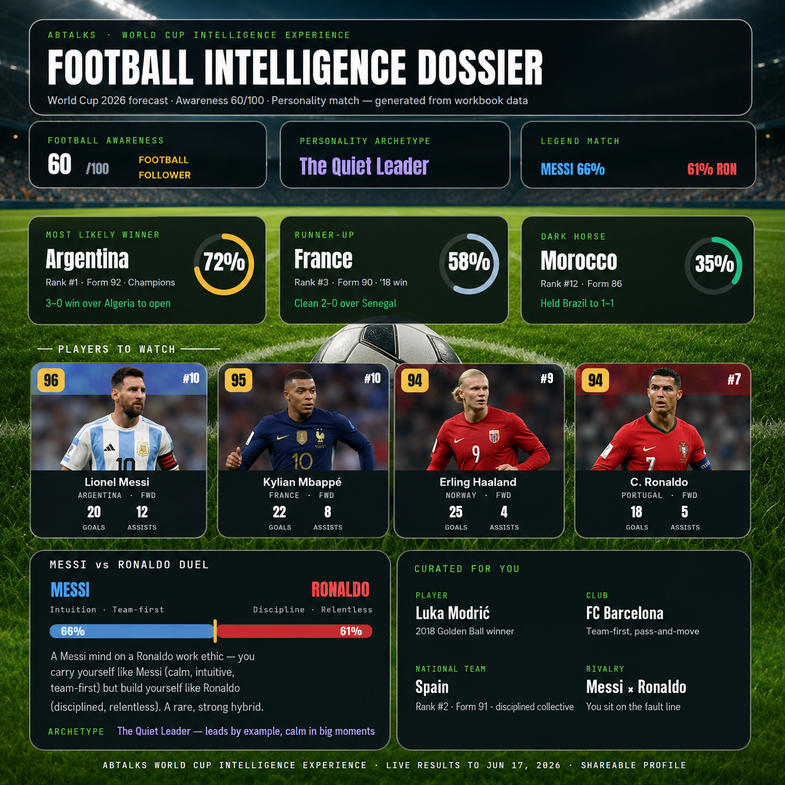

# Build an AI Face Puzzle Game  
>*Turn your face into an interactive puzzle game*

Claude can generate complete browser applications including UI design, game mechanics, camera integration, image processing, local storage, and interactive experiences. This demonstrates how AI can accelerate software development from idea to working product.

**1.Game Development:** Build interactive browser games without manual coding.  
**2.Web APIs:** Use browser camera APIs and media devices.  
**3.Image Processing:** Convert captured photos into playable puzzle pieces.  
**4.Interactive UI:** Create responsive experiences for desktop and mobile.  

**Tasks**:  
1
Read the provided resources.
2
Open Claude.
3
Set Claude effort level to Low or Medium or High.
4
Start a new conversation.
5
Paste the provided Face Puzzle Game prompt.
6
Generate the complete HTML application.
7
Save the generated HTML file.
8
Open the HTML file in your browser.
9
Allow webcam permissions when prompted.
10
Capture your photo using the camera.
11
Choose a puzzle difficulty (3×3, 4×4, or 5×5).
12
Play the puzzle game.
13
Test drag-and-drop and touch interactions.
14
Verify timer, move counter, and leaderboard functionality.
15
Complete the puzzle and review your results.
16
If you want to add creativity in this task and make itt more attractive you can do that too.
17
Take screenshots of the application and gameplay.
18
If Claude does not complete the output or usage limits are reached, wait for the reset period and continue later.
19
Create a Day20 folder in your GitHub repository.
20
Create a day20.md file.
21
Upload screenshots, generated HTML file, and learnings.
22
Commit and push the changes.
23
Submit the GitHub commit URL.  

**Input Prompt**:  
You are an expert front-end developer. Build me a complete, fully working face puzzle game as a single self-contained HTML file (no external dependencies except what can load from cdnjs.cloudflare.com, cdn.jsdelivr.net, or unpkg.com).

FEATURES REQUIRED — deliver ALL of these in one complete response:

1. CAMERA ACCESS
   - On load, request webcam permission using getUserMedia()
   - Show a live video preview (front-facing camera preferred)
   - Display a 'Take Photo' button to snapshot the user's face onto a canvas

2. PUZZLE GENERATION
   - After snapshot, let the user choose difficulty: 3×3, 4×4, or 5×5 grid
   - Slice the captured face image into equal puzzle pieces
   - Randomly scramble the pieces (guarantee it is solvable)
   - Render each piece as a draggable tile at its scrambled position

3. DRAG & TOUCH GESTURE CONTROLS
   - Support both mouse drag (desktop) and touch drag (mobile/tablet)
   - When a piece is dropped onto another piece's cell, swap their positions
   - Snap pieces to the nearest grid cell on release
   - Highlight a piece with a coloured border while it is being dragged
   - Show a green border on pieces that land in their correct position

4. TIMER & MOVE COUNTER
   - Start the timer the moment the puzzle begins
   - Display elapsed time live (format: mm:ss.t)
   - Count and display total moves made
   - Show how many pieces are correctly placed out of the total

5. WIN DETECTION & RESULTS SCREEN
   - Detect automatically when all pieces are in the correct position
   - Stop the timer immediately on win
   - Show a results overlay with: final time, total moves, and difficulty
   - Save the top 5 best times to localStorage with date, time, moves, and difficulty
   - Display a leaderboard of saved best times

6. UI & POLISH
   - Clean, modern design
   - Works on desktop and mobile
   - 'Retake Photo' button
   - 'Play Again' button
   - 'New Photo' button
   - Responsive layout

TECHNICAL REQUIREMENTS:
- Single HTML file
- All CSS and JS inline
- No frameworks
- Must work in Chrome, Firefox, and Safari
- Camera must work over HTTPS or localhost
- Handle camera permission denied gracefully
- Do NOT leave placeholder comments

Output the complete HTML file in one code block. Do not truncate or summarise any section.  

**Output**:  

