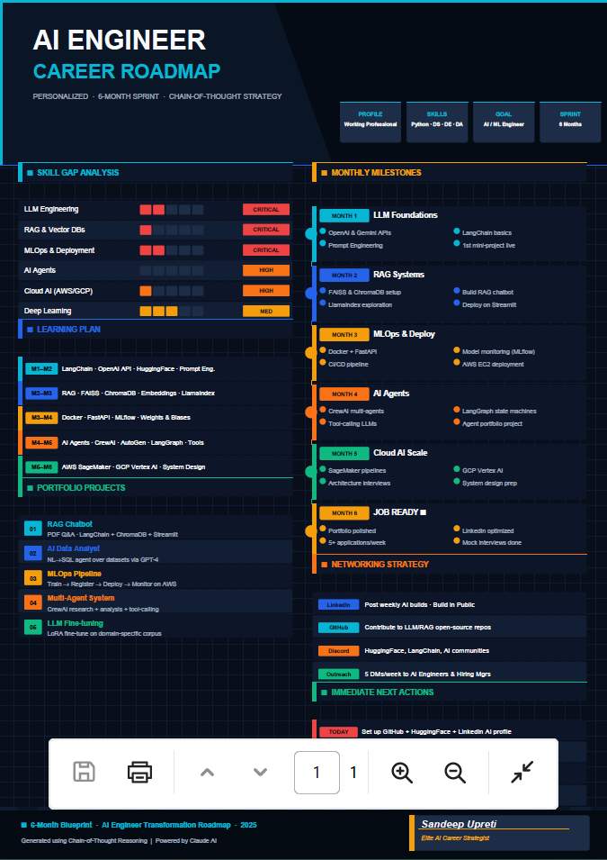

# Chain-of-Thought Prompting

Chain of thought (CoT) is a prompt engineering technique that enhances the output of large language models (LLMs), particularly for complex tasks involving multistep reasoning. It facilitates problem-solving by guiding the model through a step-by-step reasoning process by using a coherent series of logical steps. 

Researchers were inspired by the LLMs’ ability to “think out loud” in natural language, noting that as parameter size increased, so did reasoning ability and accuracy. For this reason, CoT prompting is considered an emergent ability, or an ability that appears as model size or complexity scales up. 

**Prompt chaining** is another popular method used in gen AI applications to improve reliability by using multiple prompts that build on each other sequentially to break down complex tasks. Techniques such as prompt chaining and CoT guide the model to reason through a problem step-by-step rather than jumping to an answer that merely sounds correct. This method can also be helpful for observability and debugging, as it encourages the model to be more transparent in its reasoning. The main difference between these methods is that prompt chaining sequences multiple prompts to break down tasks step-by-step, while CoT prompting elicits the model’s reasoning process within a single prompt.

**COT Key Advantages:**  
1.**Better reasoning**: Breaking problems into steps improves accuracy and depth.  
2.**More reliable outputs**: Claude evaluates assumptions before providing recommendations.  
3.**Personalized solutions**: Structured thinking creates highly customized outputs.  
4.**Real-world applications**: Career planning, business strategy, decision-making, and project planning become significantly better.

**Practical Demonstration**:

1.**Input Prompt**:  
You are an Elite AI Career Strategist.

Your goal is to build a personalized roadmap for me.

Before creating the roadmap, ask me ONLY these 4 questions:

Question 1
What is your current situation?
Examples:
• Student
• Working Professional
• Freelancer
• Founder
• Career Switcher

Question 2
What skills do you currently have?
Examples:
• Python
• Marketing
• Data Science & AI
• Data Engineering
• Sales
• Design
• Web Development
• Data Analysis

Question 3
What is your target goal?
Examples:
• Get a job
• Land an internship
• Become a Data Scientist
• Become an AI Engineer
• Start a business
• Grow on LinkedIn

Question 4
What is your target timeline?
Examples:
• 3 months
• 6 months
• 1 year
• 2 years

After collecting all answers:

Think step by step.

1. Analyze my current position.
2. Identify strengths.
3. Identify skill gaps.
4. Identify the fastest path to the goal.
5. Recommend learning priorities.
6. Recommend projects.
7. Recommend networking strategy.
8. Create milestones.

Finally generate a visually structured ONE-PAGE roadmap.

The roadmap must contain:

🚀 Current Position
🎯 Target Goal
📈 Skill Gap Analysis
🛠 Recommended Learning Plan
💼 Suggested Projects
🌐 Networking Strategy
📅 Monthly Milestones
⚡ Immediate Next Actions

PDF DESIGN REQUIREMENTS:

• A4 Portrait Layout
• Professional consulting-report style
• Clean sections with visual hierarchy
• Tables wherever appropriate
• No overlapping text
• Use concise content
• Use visual dividers
• Maximum one page
• My artistic Digital Signature at side bottom of portrait(Name: Sandeep  Upreti)
• Export-ready PDF format
• Easy to screenshot and share on LinkedIn

End with:

Generated using Chain-of-Thought Reasoning

**Output**:  

**Tool of the Day**:

**Capsule Hub**:
Capsule Hub by Tilantra is a context-transfer layer for modern AI work. It turns chats and email threads into portable Capsules—structured bundles of goals, constraints, background, and attachments—so you can move work between models and tools without rebuilding context from scratch.

Most teams lose hours re-explaining the same situation to every new chat. Capsule Hub makes that knowledge capture-once, inject-anywhere: from research in Gemini to execution in ChatGPT, from a Gmail thread to requirements in GPT, from a capsule in Cursor (via MCP) back to review in Claude—with versioning along the way.

