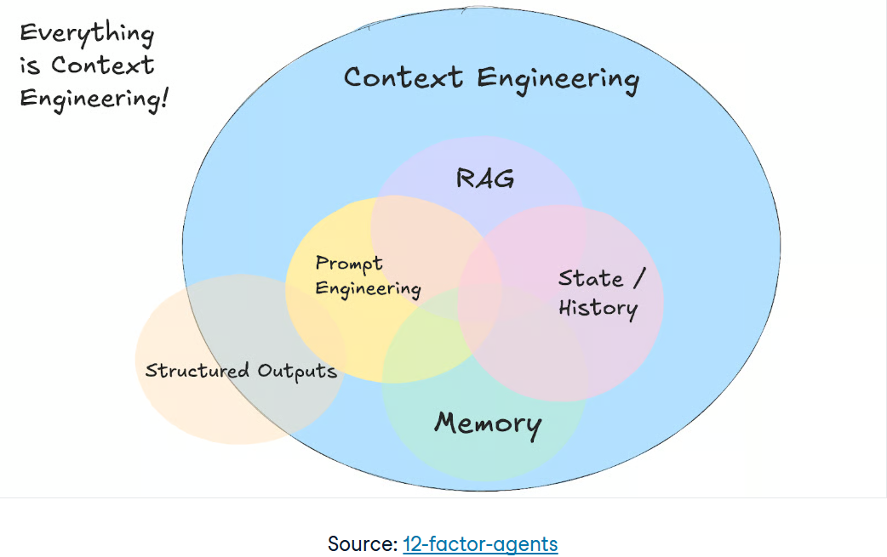
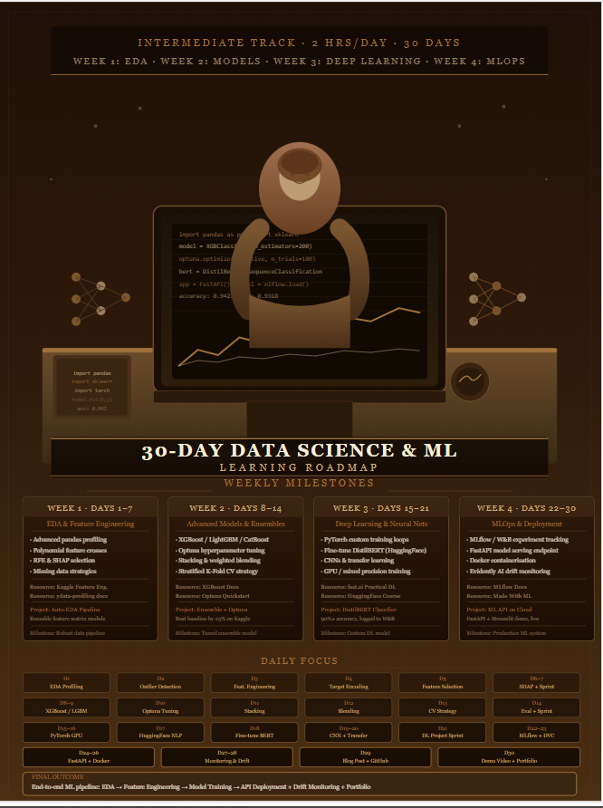
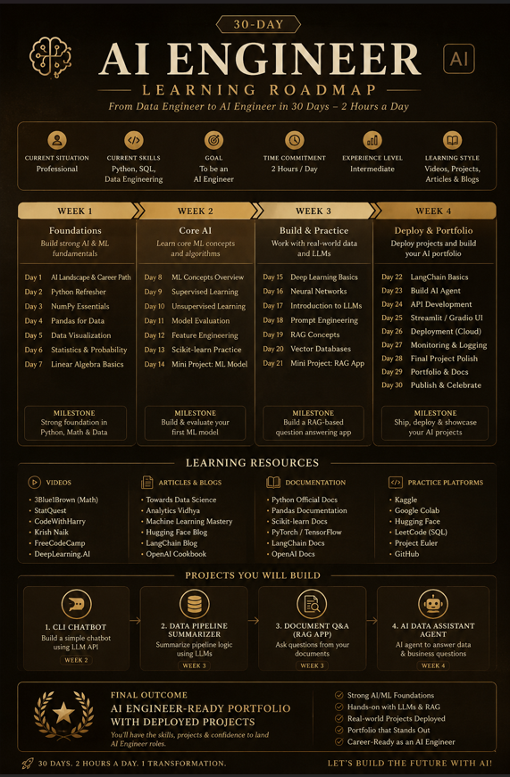

# Context Engineering:  
Context engineering is the practice of designing systems that decide what information an AI model sees before it generates a response.

Even though the term is new, the principles behind context engineering have existed for quite a while. This new abstraction allows us to reason about the most and ever-present issue of designing the information flow that goes in and out of AI systems.

Instead of writing perfect prompts for individual requests, you create systems that gather relevant details from multiple sources and organize them within the model’s context window. This means your system pulls together conversation history, user data, external documents, and available tools, then formats them so the model can work with them.  

  

**Context Engineering vs Prompt Engineering**:  
Prompt Engineering focuses on crafting the instructions given to the model, while Context Engineering focuses on providing the right information, tools, memory, and data the model needs to complete the task effectively.

A concise way to remember it:

>*Prompt Engineering = What you ask the model.*  
>*Context Engineering = What you give the model before it answers.*

**Practical Demonstration:**  

**Input Prompt A:**  
Create a 30-day learning roadmap.

Include:
- Weekly milestones
- Daily tasks
- Resources
- Projects
- Final outcome

Make it practical and beginner-friendly.

Generate the Linked-In shareable AI cinematic portrait for the roadmap. Use Claude-inspired brown, beige and cream colors  

**Output**  
  

**Input Prompt B:**  

Create a 30-day learning roadmap.

Context:
- Current Situation: Professional
- Current Skills: Python Programing, SQL, Data Engineering
- Goal: To be an AI Engineer
- Available Time: 2 hours per day
- Experience Level: Intermediate
- Preferred Learning Style: Videos, Public Projects, Articles and Blogs

Include:
- Weekly milestones
- Daily tasks
- Resources
- Projects
- Final outcome

Make it practical and beginner-friendly.

Generate the Linked-In shareable AI cinematic portrait for the roadmap. Use Claude-inspired brown, beige and cream colors.  
**Output**:  

