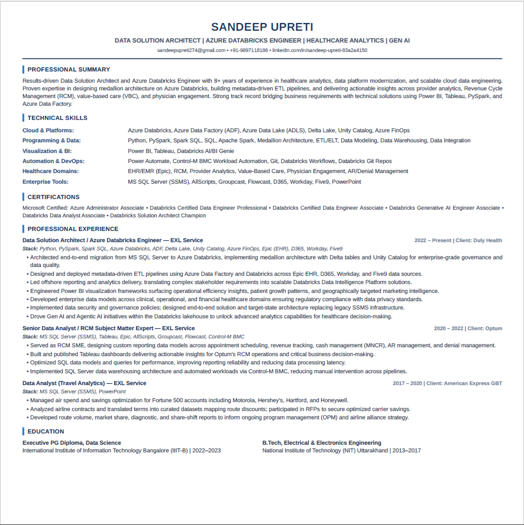

# AI-Resume Optimizer:  

This basically involves using AI for converting traditional , non-actionable, conventional Job resumes & profiles into a dynamic and recruiter ready aseet.  

**Input Prompt**:  

You are an ATS optimization expert and resume writer. Rewrite my resume (attached the .pptx resume file) for maximum ATS parsing and recruiter readability, keeping every claim truthful to the source. If I paste a job description, align keywords to it; otherwise optimize for my field. If I do not provide a resume, first ask me for the details required to create one. Output EXACTLY two parts, nothing else: PART 1 — ATS SCORE (keep short, no full report) - Previous Score: __/100 - Optimized Score: __/100 - 5–8 bullets, each stating what you changed and why it raised the score. PART 2 — FINAL RESUME Generate the optimized resume and provide it in a PDF-ready one-page A4 format. Formatting: - Single column - No tables, columns, icons, images, or text boxes - Name large and bold - Contact directly under it as plain text - ATS-friendly section headings - Professional Summary - Education - Experience - Projects - Skills - Certifications (if present) Rules: - Use ONLY information from the resume. - Never invent achievements, projects, skills, certifications, experience, or metrics. - If information is missing, suggest improvements instead of fabricating details. - Use strong action verbs. - Remove redundancy. - Keep everything truthful. - Must fit on ONE A4 page. - Optimize for ATS and recruiter readability. If no resume is uploaded, ask for: - Name - Contact Information - Education - Experience - Projects - Skills - Certifications - Target Field Then generate the resume.  

**Original Resume**:  
  
  

**AI-Optimized resume**:  

