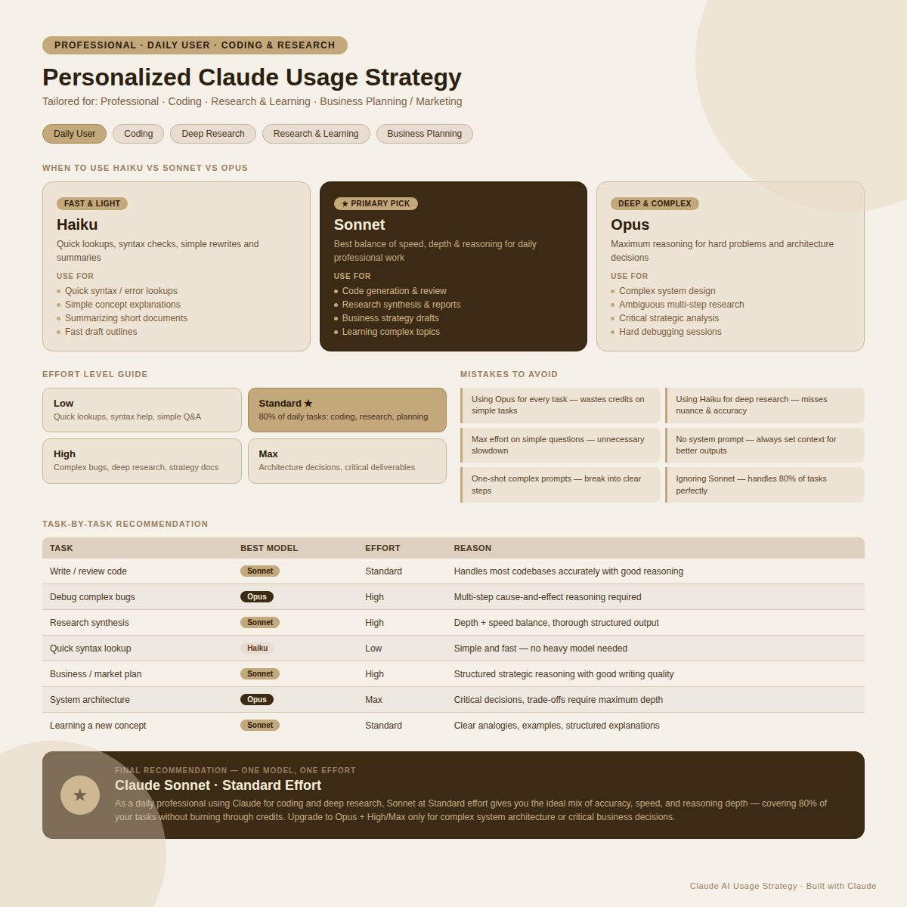

# Claude Model Selection & Reasoning effort:  

Claude offers different models optimized for different types of work. Understanding when to use Haiku, Sonnet, Opus, and different reasoning effort levels helps you get better outputs while improving efficiency.

**1.Haiku:** Best for speed, quick summaries, rewrites, and simple tasks.
**2.Sonnet:** Best balance of intelligence, speed, and cost. Ideal for most users.
**3.Opus:** Best for deep research, strategy, complex planning, and advanced reasoning.
**4.Reasoning Effort:** Low, Standard, High, and Max determine how much thinking Claude performs before answering.  

**My Personlaized Claude Usage Stragey**:  
  

**Tool Of the Day: Claude Usage Counter**:  
Claude Counter helps monitor Claude usage, message limits, and consumption directly inside Claude's web interface.    
Download the extension from following github link: https://github.com/she-llac/claude-counter

